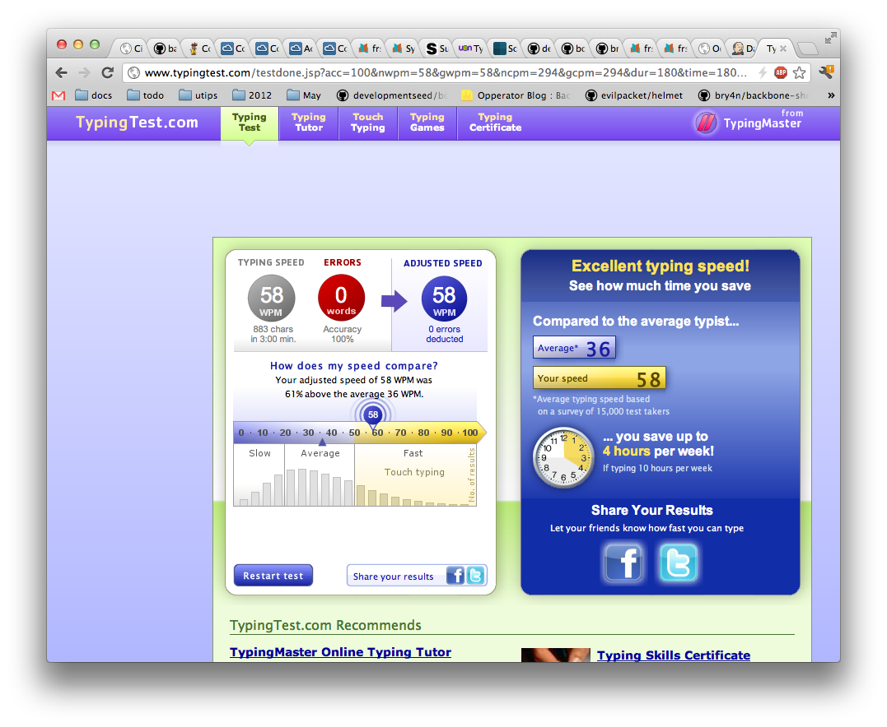

## Reflective Writing

Knowing how to touch type should be a pre-requisite. Seriously, no programmer or computer profesional should be out there in the world hunting and pecking at their keyboard. It would be a bit of a disgrace. Even though when programming you rarely type at full-speed, if you need to look at the keyboard for characters or special syntax, there is no way you can properly concentrate on any tasks at hand. 

Once again I hate Flash player, and I think it's funny when I come across sites that don't have clean extensions. No one uses jsp anymore, how dated!

Fun fact, I used to be one of the worst hunt and peck typists. The only way I found to overcome this disability of mine was to switch the keyboard to Dvorak. At that point I could no longer "cheat" by looking at the keys I would type. I had gotten pretty fast at peck typing while looking at the keyboard, but now that habit was negatively reinforced since the lettering on the keys no longer matched up. After the novelty of Dvorak wore off, and also after dealing with the difficulty that would arise when any coworker of mine would try to help me with a problem or IT issue, I decided to switch back to Qwerty for compatibility sake. I now touch type with ease, though I did always find Dvorak faster. I probably averaged 10-15 wpm more with Dvorak than Qwerty.